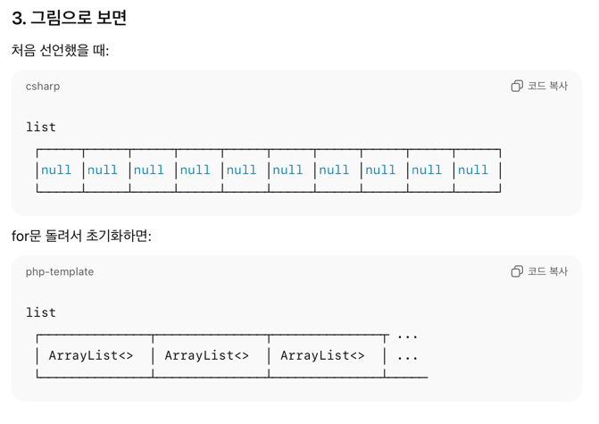

### 자바 배열 초기화 규칙
배열 만들면, 타입별 기본값으로 다 채워짐.
숫자 타입 → 0, 0.0
boolean → false
객체/문자열 → null

### 나머지 연산
나눗셈을 제외하고, 분배 법칙 성립
ex. (A+B) % C == (A%C + B%C) % C

### import문 지식
import java.util.*;만 있으면 거의 커버 가능

### Comparable 인터페이스
public interface Comparable<T> {
    int compareTo(T t);
}
반드시 compareTo()를 오버라이딩 해야하고, 그 클래스의 객체끼리 크기 비교가 가능

### compareTo 메서드의 규칙
compareTo(T t)는 정수(int)를 반환하는데, 의미는 다음과 같다:
음수 → this 객체가 t보다 "작다" (앞에 온다)
0 → 두 객체가 "같다"
양수 → this 객체가 t보다 "크다" (뒤에 온다)

https://velog.io/@minyeongg/Comparable과-Comparator-인터페이스

### ArrayList 선언
1. ArrayList<Edge> list[] = new ArrayList<Edge>[10]; 이렇게 안 하는 이유?
-> 자바의 제네릭은 컴파일 타임에만 존재하고, 런타임에는 지워(타입 소거, Type Erasure) 버림.
즉, ArrayList<Edge> 와 ArrayList<String> 을 구분할 수 없음 → 둘 다 그냥 ArrayList로 보임.
그래서 자바에서는 제네릭 타입 배열 (new ArrayList<Edge>[10])을 만들 수 없다고 막아놓음.

2. 그래서 어떻게 하냐?
   ArrayList<Edge>[] list = new ArrayList[10]; // 제네릭은 빼고 생성

그리고 나서 칸마다 직접 넣어줘야 함.
   for (int i = 0; i < 10; i++) {
      list[i] = new ArrayList<>();
   }

그림으로 확인.
